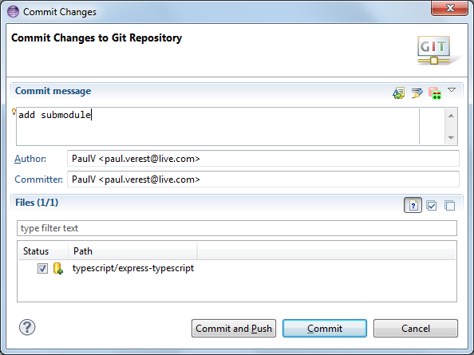

org.nodeclipse.examples
=======================

Examples for Node.js in JavaScript, CoffeeScript, [TypeScript](http://www.typescriptlang.org/)

Use `git clone`, and select <kbd>Import.. -> General \ Existing Project into Workspace</kbd>  
or select <kbd>import existing project</kbd> when using EGit.

## To get more examples

One more known example is at <https://github.com/hdeshev/express-typescript.git> .
Here below we get it as git submodule ([some theory and intro](http://git-scm.com/book/en/Git-Tools-Submodules),
but the best help was `git help submodule`).

    git submodule init
    git submodule update

### More on git submodules

Created with following steps in `org.nodeclipse.examples` folder

	cd typescript
	git clone https://github.com/hdeshev/express-typescript.git
	cd ..
	git submodule add https://github.com/hdeshev/express-typescript.git typescript/express-typescript
	
	git submodule status
	
-> 8ed925333a26154a461d218bfff54cf4d7c402b4 typescript/express-typescript (heads/master)
	
	git submodule init

then commit the changes into main (now called super) repository. EGit has some support as it showed special icon for the case.

This was not helping to start <http://blogs.atlassian.com/2013/03/git-submodules-workflows-tips/>
but may be useful later.

## TODO

- [v] add module
- [ ] Bugzilla - Eclipse crushes when manually associating .gitignore, .gitmodules with Text Editor in Preferences -> General -> Editors -> File Associations
- [ ] Nodeclipse - associate .gitignore, .gitmodules with Text Editor
- [ ] ? How to git clone if repo is too big and connection is unstable or server hungs up.

